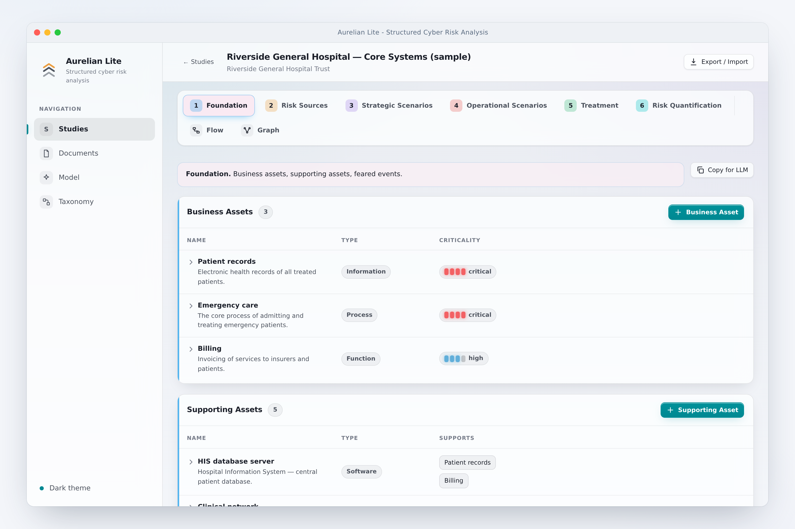
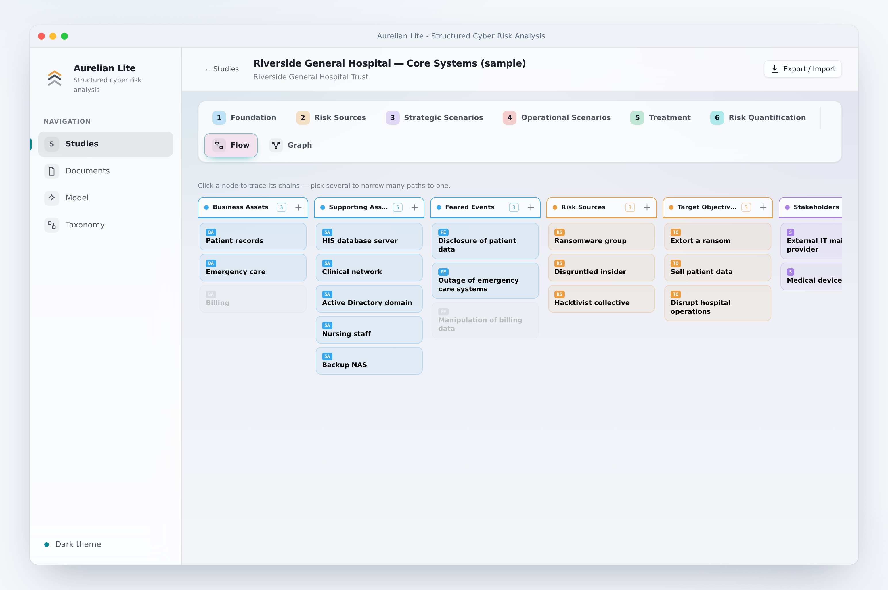
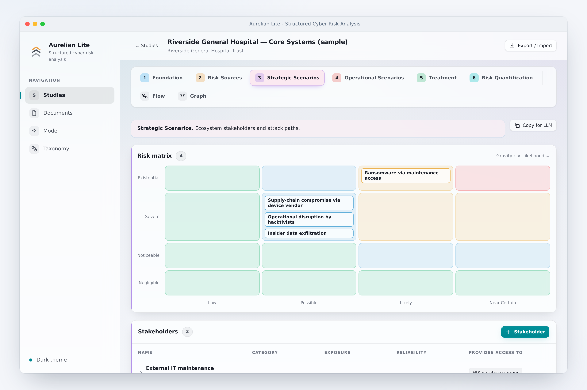

<div align="center">
  <h1>Aurelian Lite</h1>
  <p><strong>Structured cyber &amp; information security analysis - threat modelling and risk quantification, offline in a single file</strong></p>
  <p>
    <a href="LICENSE"></a>
    
  </p>
</div>

Aurelian Lite is a browser-based tool for **structured cyber and information security
analysis** - covering **threat modelling and risk quantification** - with an approach
**inspired by EBIOS Risk Manager (EBIOS RM) and ISO/IEC 27005**. It helps analysts move from
organisational context to a set of prioritised, defensible risk scenarios - modelling assets,
threats, attack paths and treatments as one connected picture of an organisation's exposure.

It runs entirely in your browser, offline, from a single file. No server, no account, no
installation, and nothing ever leaves your machine.

<div align="center">

</div>

## The methodology

The EBIOS RM methodology organises an assessment into five successive workshops, aligned with
the risk-management concepts of ISO/IEC 27005. Aurelian Lite mirrors that structure:

1. **Foundation** - identify the business assets that matter and the events the organisation
   fears (a loss of availability, confidentiality or integrity), together with the supporting
   assets they depend on.
2. **Risk sources** - characterise who might attack and what they are trying to achieve.
3. **Strategic scenarios** - map how those threats could reach the organisation through its
   ecosystem of stakeholders, suppliers and partners.
4. **Operational scenarios** - detail the concrete technical attack paths as kill-chains,
   mapped to **MITRE ATT&CK®** tactics.
5. **Treatment** - define the security measures that reduce each risk and track how well they
   cover the identified attack steps.

A closing risk-quantification step rates each scenario by likelihood and severity, so the most
significant risks stand out.

Everything you record is connected - assets, threats, scenarios, techniques and measures form
a single **knowledge graph**, letting you trace any risk from its source all the way to the
control that mitigates it.

## What it offers

- **Interactive knowledge graph** of the whole analysis, so relationships and gaps are visible
  at a glance.
- **Cross-workshop attack-path view** that follows a scenario from a threat source through the
  ecosystem to the affected assets.

<div align="center">

</div>

- **Risk matrix** - a likelihood × severity heatmap that positions every scenario at a glance.

<div align="center">

</div>

- **MITRE ATT&CK® kill-chain builder** - arrange attack steps onto tactic lanes to describe how
  an operation unfolds.
- **Portable, private data** - export and import a complete study as JSON or YAML to move it
  between machines. It is the only way your data ever travels.

## Assisted extraction - a model that runs on your machine

Turning a pile of documents into a structured analysis is the slow part of any assessment.
Aurelian Lite can help - **entirely on your device**.

Attach reference material (policies, network descriptions, incident reports, threat
intelligence…) and Aurelian Lite runs a small **embedding model directly in your browser** to
read the text and propose candidate entities for each part of the analysis - assets, feared
events, risk sources, and so on. You review every suggestion and decide what enters the study;
nothing is added automatically, and nothing is ever uploaded.

The model (for example `all-MiniLM-L6-v2`, ~25 MB) is downloaded once from a public source and
then cached locally - or kept as a portable file next to the app - so from then on extraction
works fully offline. It is the one optional, opt-in piece of intelligence in an otherwise
deterministic tool; everything else in Aurelian Lite works without it.

## Private and offline by design

There is no backend, no account and no telemetry. Your analysis is stored locally in your
browser, and the entire application ships as one `index.html` that opens with a double-click on
any modern browser - ideal for sensitive assessments that must stay on a controlled machine.

## Getting started

**Run it** - download `index.html` from the [latest release](https://github.com/aurelian-risk/aurelian-lite/releases/latest),
double-click to open it, and choose **Load sample study** to explore a worked example.

**Build from source**

```bash
npm install
npm run build      # produces dist/index.html - the single, offline app
npm run dev        # or run a live development server
```

Built with React and Vite and bundled into a single self-contained file.

## About Aurelian Risk Manager

Aurelian Lite is the free, open-source, offline companion to **Aurelian Risk Manager** -
*AI-driven cyber risk analysis*.

Aurelian Risk Manager is an enterprise platform that automates the full assessment end to end:
AI agents turn an organisation's documentation and threat intelligence into quantified,
auditable risk analyses on a unified knowledge graph, combining an **EBIOS RM-inspired**
methodology, **MITRE ATT&CK®** technique mapping and **Monte-Carlo** risk quantification
expressed as monetary loss ranges. It is built for organisations meeting NIS2 obligations
without a dedicated security team, and for security teams that want to accelerate and scale
their work.

Where Aurelian Risk Manager automates the analysis, Aurelian Lite gives you the same structure
as a lightweight modelling tool you can run anywhere, entirely on your own machine. Learn more
at **[aurelian-risk.com](https://aurelian-risk.com)**.

## License

[MIT](LICENSE) © Aurelian-Risk

## Disclaimer

Aurelian Lite is provided "as is" and "as available", without warranties or conditions of any
kind, whether express, implied or statutory, including but not limited to any implied warranties
of merchantability, fitness for a particular purpose, title, non-infringement, accuracy,
reliability or availability.

- **Not professional advice.** Aurelian Lite is a risk-modelling aid, not professional security,
  legal, regulatory, financial or compliance advice, and is not a substitute for qualified
  expertise or an independent assessment.
- **No guaranteed results.** All outputs, including any suggestions produced by the on-device
  model and any likelihood, severity or risk ratings, may be incomplete, inaccurate or wrong.
  The tool does not detect, identify or quantify all risks, threats, vulnerabilities or scenarios.
  You are responsible for independently reviewing and validating every result before relying on it.
- **No compliance guarantee.** Using Aurelian Lite does not certify, ensure or demonstrate
  conformity with EBIOS RM, ISO/IEC 27005, NIS2 or any other framework, standard or regulation.
- **Your responsibility.** You use Aurelian Lite entirely at your own risk and are solely
  responsible for any decisions, actions, configurations and omissions based on it, and for the
  confidentiality, integrity, backup and lawful processing of any data you enter. Data is kept
  locally in your browser and may be lost (for example by clearing browser data); no
  responsibility is accepted for any such loss.
- **Third-party components.** Models, datasets and libraries obtained from third parties
  (including any downloaded machine-learning model and MITRE ATT&CK content) remain the
  responsibility of their respective owners and are subject to their own terms; no responsibility
  is accepted for third-party content.
- **Limitation of liability.** To the fullest extent permitted by applicable law, the authors,
  contributors and Aurelian-Risk shall not be liable for any direct, indirect, incidental,
  special, consequential, exemplary or punitive damages, nor for any loss of data, profits,
  revenue, business, goodwill or reputation, nor for any other damage or harm of any kind, arising
  out of or in connection with the use of, or inability to use, Aurelian Lite, even if advised of
  the possibility of such damages.

By downloading, building or using Aurelian Lite you acknowledge and accept this disclaimer.
Nothing in it excludes or limits any liability that cannot be excluded or limited under
applicable law.

---

<div align="center">
  <a href="https://aurelian-risk.com"></a>
  <br>
  <sub>An open-source project by <a href="https://aurelian-risk.com"><strong>Aurelian-Risk</strong></a></sub>
  <br><br>
  <sub>Aurelian Lite is <strong>inspired by</strong> the EBIOS Risk Manager methodology (published by
  ANSSI) and ISO/IEC 27005. It is an independent tool and is <strong>not certified by or affiliated
  with</strong> ANSSI or ISO. MITRE ATT&CK® is a trademark of The MITRE Corporation.</sub>
</div>
